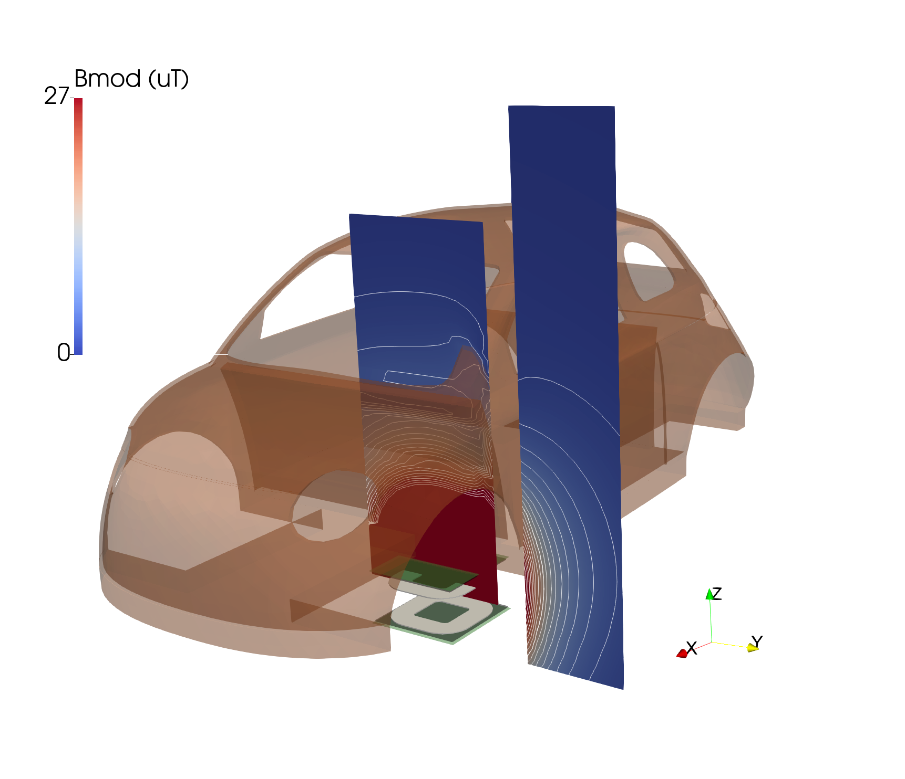
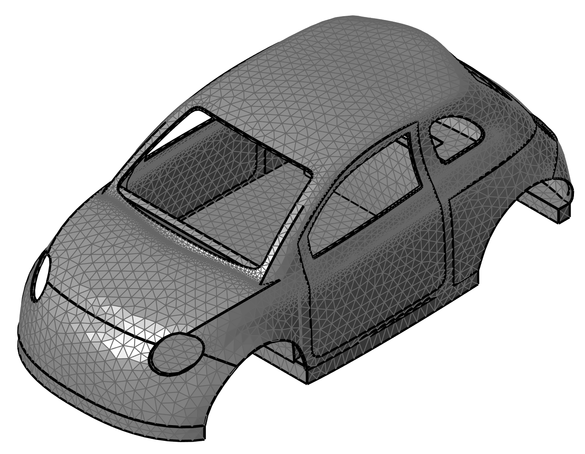
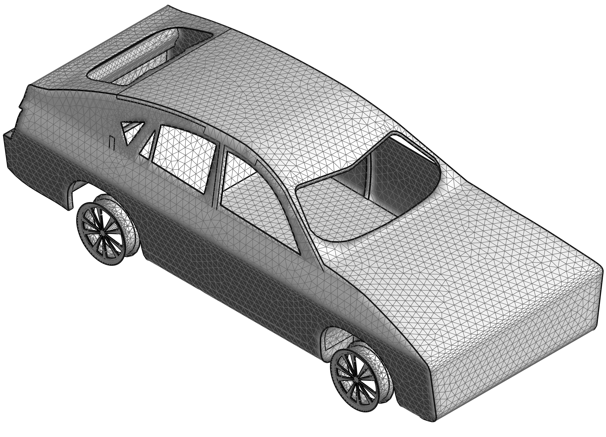
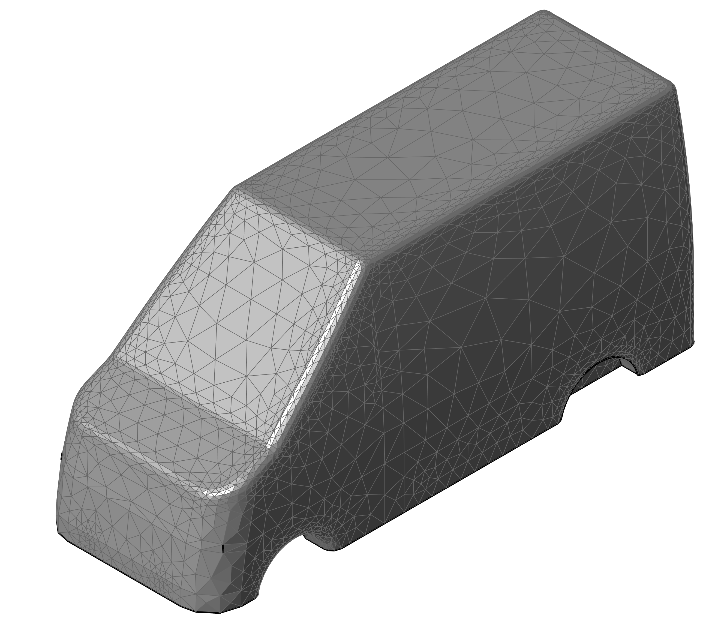

# vehicle4em


***

## Table of content
* [1. Introduction](https://github.com/cadema-PoliTO/vehicle4em#introduction)
* [2. Screenshot](https://github.com/cadema-PoliTO/vehicle4em/tree/dev?tab=readme-ov-file#2-screenshot)
* [3. Download instructions](https://github.com/cadema-PoliTO/vehicle4em/tree/dev?tab=readme-ov-file#3-download-instructions)

## 1. Introduction
This repository contains CAD models of vehicles and volumetric meshes (composed of tetrahedra) in `.vtu` format, intended for use in electromagnetic simulations. For example, the following image depicts a Fiat 500 exposed to magnetic fields generated by a wireless power transfer system:

<p align="center">

</p>


## 2. Screenshot

**Fiat 500**
<p align="center">

</p>

**BMW X6**

<p align="center">

</p>

**IVECO Daily**

<p align="center">

</p>

**Mini**

<p align="center">

</p>

## 3. Download instructions

### 3.1 CAD Models

*We are working on the CAD to make them more homogeneous. They will be uploaded here as soon as possible.* If your really need a CAD right now, please contact the authors by email with this link:
* [contact the authors](mailto:fabio.freschi@polito.it,luca.giaccone@polito.it)


### 3.2 Unstructured mesh filed (vtu format)

You can access a shared folder using [this link](https://drive.google.com/drive/folders/1erye-jtA3xx1Um7UCCMqewos2cXu--xH?usp=sharing), which contains four `.vtu` files representing the unstructured mesh of the corresponding vehicles. The `.vtu` format is an XML-based representation of unstructured grid datasets used by the [Visualization Toolkit (VTK)](https://vtk.org/). As part of the VTK XML family, it provides a structured, extensible, and portable means of encoding scientific data.

It is straightforward to visualize the models using the free and open source software [Paraview](https://www.paraview.org/). If you need to extract the data, the shared folder also includes a Python script named `import_mesh.py`, which can be used to extract point coordinates, cell connectivity, and the associated data fields, including object codes. This script requires the [`meshio`](https://pypi.org/project/meshio/) module. Below, you can see the content of the script used to extract data for the Fiat 500 model.


 ```python
 import meshio

# import mesh
mesh = meshio.read("500.vtu")

# get points
points = mesh.points

# get connectivity
connectivity = mesh.cells[0].data

# get object codes
obj = mesh.cell_data['obj'][0]
 ```


