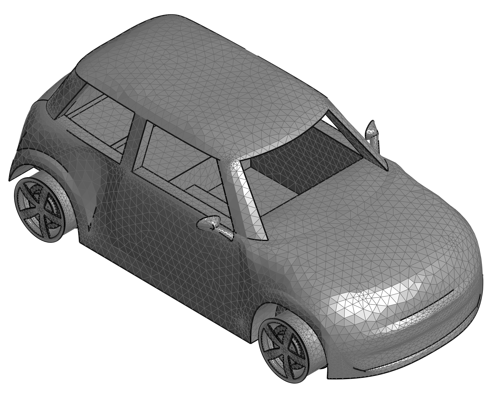

# vehicle4em

***

This repository includes Vehicle CAD models for electromagnetic simulations. To give an example, the following image refers to a Fiat 500 subject to the magnetic fields generated by a wireless power transfer system:

*We are working on the CAD to make them more homogeneous. They will be uploaded here as soon as possible.* If your really need a CAD right now, please contact the authors by email (click on the names to get the email address).
* [Fabio Freschi](mailto:fabio.freschi@polito.it)
* [Luca Giaccone](mailto:luca.giaccone@polito.it)

## 1. Fiat 500

## 2. BMW X6

## 3. IVECO Daily

## 4. Mini

